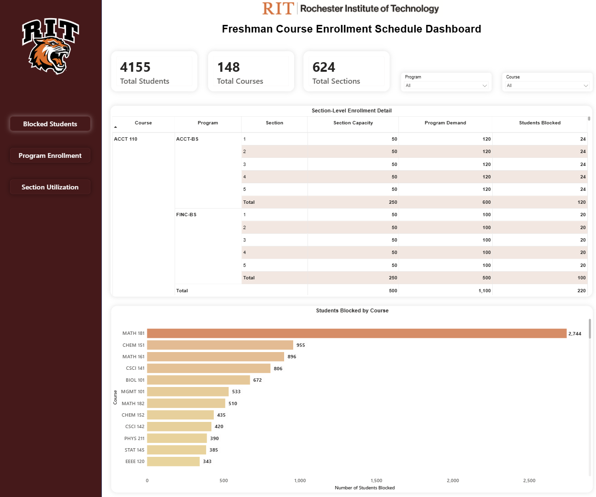
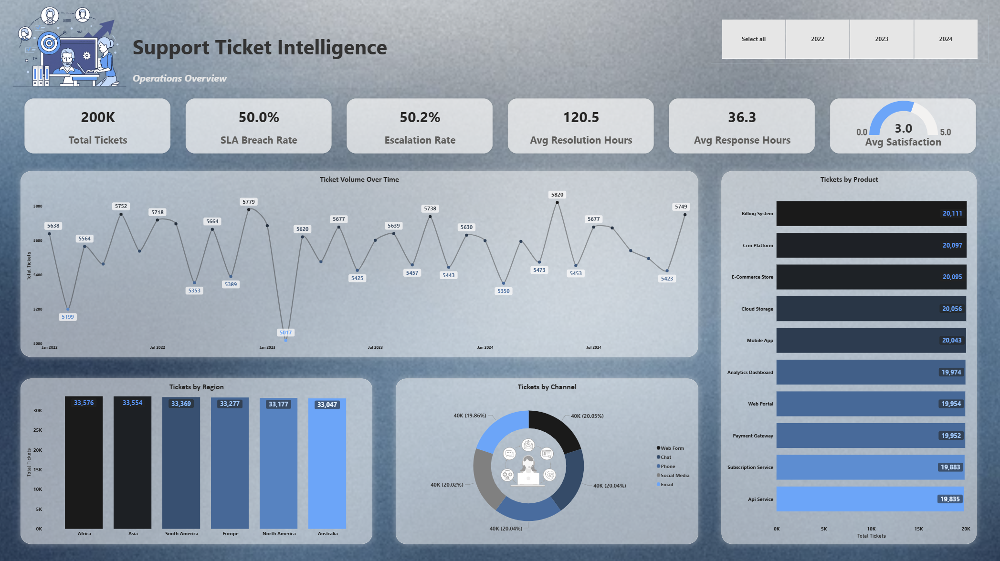
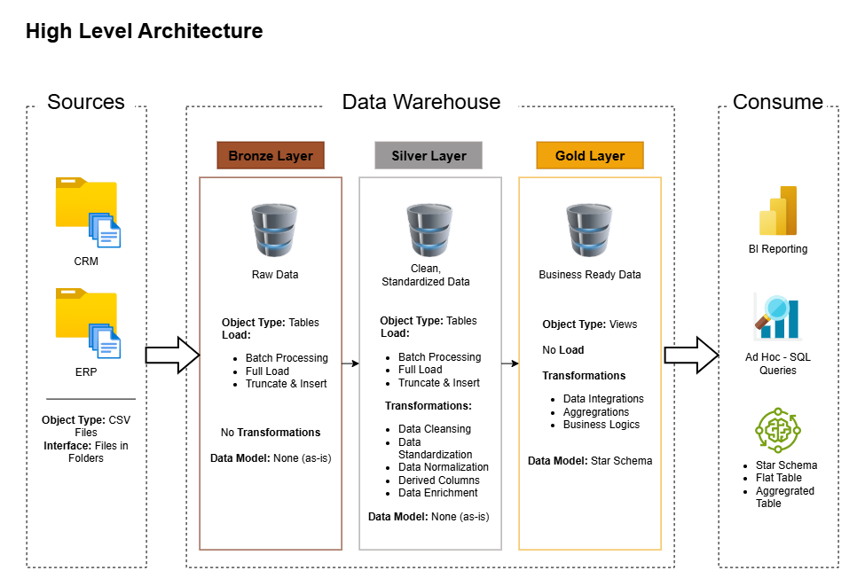
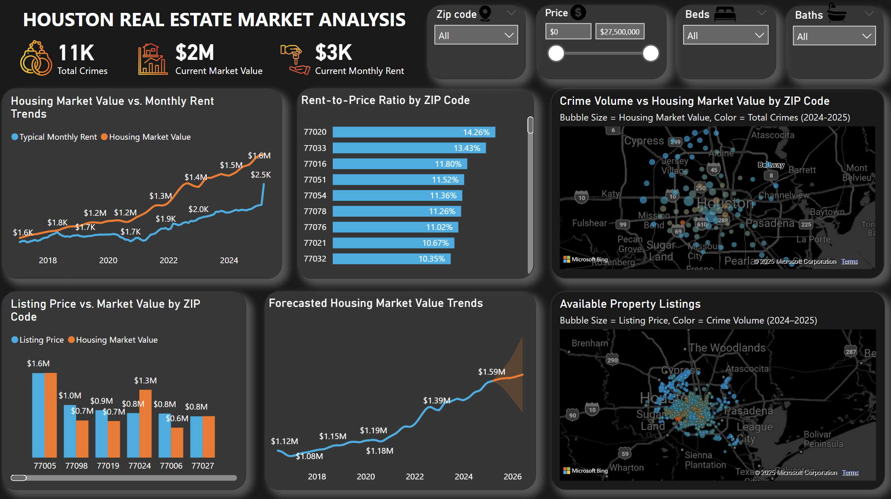

# Priyaa Gopal Shankar

### Data Analyst · Business Intelligence · Trusted Data Systems

I build analytics systems that turn complex, multi-source data into trustworthy information for decision-making. My work spans enterprise and higher-education analytics, with hands-on experience in SQL, Power BI, Python, Snowflake, reporting automation, dimensional modeling, and data quality.

I care about the full chain behind a metric—where it came from, how it was transformed, whether it was validated, and what its limitations are. I am extending that foundation into analytics engineering, data warehousing, and AI-assisted data systems with an emphasis on validation and reproducibility.

[LinkedIn](https://www.linkedin.com/in/priyaa-g-s/) · [Email](mailto:priyaagopalshankar@gmail.com)

---

## Featured Work

### EduInsight

**Institutional Analytics · Data Quality · Governance · AI-Assisted Analytics**

  

Built an institutional intelligence platform that brings enrollment, student outcomes, data quality, IPEDS readiness, scenario planning, and institutional knowledge into one governed analytics environment. The system is designed to give decision-makers useful answers while preserving the lineage, validation, and context behind the numbers.

EduInsight combines governed source data, lifecycle-based data-quality findings, auditable changes, source-backed institutional metrics, scenario modeling, and a natural-language analytics interface designed to prevent unsupported answers.

**What it demonstrates:** institutional analytics · data governance · data quality · AI-assisted analytics · validation · decision-support system design

[Explore project →](https://github.com/priyaa279/eduinsight)

---

### Automated Freshman Course Scheduling

**Python · Google OR-Tools · CP-SAT Optimization · LLMs · Power BI**

  

Built an RIT capstone prototype that schedules 4,155 synthetic students across 634 sections while enforcing institutional scheduling policies. Administrators express policies in plain English, and LLM-generated constraints are validated for syntax, schema, semantics, and security before reaching the CP-SAT optimizer. The reported run scheduled all students with zero time conflicts.

**Recognition:** Best Project Runner-Up — RIT CS Graduate Projects 2026  
**What it demonstrates:** optimization · verified AI integration · validation · end-to-end system design

[Explore project →](https://github.com/priyaa279/automated-freshman-scheduler)

---

### Support Ticket Intelligence

**Snowflake · SQL · Power BI · Dimensional Modeling · Data Quality**

  

Built a Snowflake analytics platform over 200,000 synthetic support tickets to investigate service performance, customer risk, and routing quality. The project combines layered warehouse design, dimensional modeling, SQL-based risk scoring, data-quality checks, and Power BI; a priority-severity audit surfaced a potential 10% routing gap for investigation.

**What it demonstrates:** warehouse design · business-focused SQL · data-quality analysis · honest interpretation

[Explore project →](https://github.com/priyaa279/snowflake-support-intelligence)

---

### SQL Data Warehouse

**SQL Server · T-SQL · ETL · Dimensional Modeling · Data Quality**

  

Building and extending an end-to-end SQL Server analytics warehouse that integrates CRM and ERP source data through Bronze, Silver, and Gold layers. The project includes stored-procedure-driven loads and transformations, Silver- and Gold-layer quality checks, a business-ready star schema, architecture diagrams, and a data catalog.

**What it demonstrates:** source integration · layered warehouse architecture · ETL · documentation

[Explore project →](https://github.com/priyaa279/sql-data-warehouse-project)

---

### Houston Real Estate Analytics

**Python · PostgreSQL · Power BI · Web Scraping**

  

Integrated Zillow housing and rent data, Houston crime data, and scraped Redfin listings into a PostgreSQL-backed analytics workflow and Power BI dashboard for comparing affordability, rental potential, market trends, and neighborhood-level indicators across Houston ZIP codes.

**What it demonstrates:** multi-source integration · data preparation · market analysis · BI delivery

[Explore project →](https://github.com/priyaa279/real_estate_rentals_analysis)

---

## Technical Focus

- **Analytics & BI:** SQL · Power BI · Tableau · Excel · Power Query
- **Data & Warehousing:** Snowflake · SQL Server · PostgreSQL · dimensional modeling · ETL · data quality
- **Programming & Tools:** Python · Pandas · NumPy · Git/GitHub
- **Currently deepening:** analytics engineering · modern ELT · warehouse architecture · AI-assisted data systems

## Experience Behind the Projects

Approximately 3.5 years of professional experience across enterprise analytics and higher-education institutional research.

- **RIT — Institutional Research, Data & Analytics:** SQL/BI reporting, automation, and data-quality work across enterprise environments totaling 150M+ records, supporting institutional decision-making.
- **Infosys / Sysco Foods:** enterprise BI, SQL/Python analytics, automation, stakeholder reporting, and documentation.

**Education:** MS in Computer Science · Advanced Graduate Certificate in Big Data Analytics · Rochester Institute of Technology, 2026

## Other Work

**[Revised Stopwords](https://github.com/priyaa279/revised_stopwords)** — an installable Python/NLP package that preserves sentiment-bearing negations and intensity modifiers during text preprocessing.

## Connect

I'm currently exploring Data Analyst, BI Analyst, Analytics, and Institutional Research opportunities.

[Connect on LinkedIn](https://www.linkedin.com/in/priyaa-g-s/) · [Email me](mailto:priyaagopalshankar@gmail.com)
